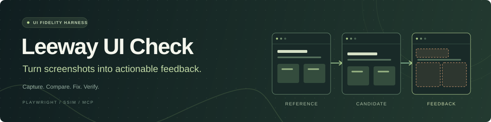
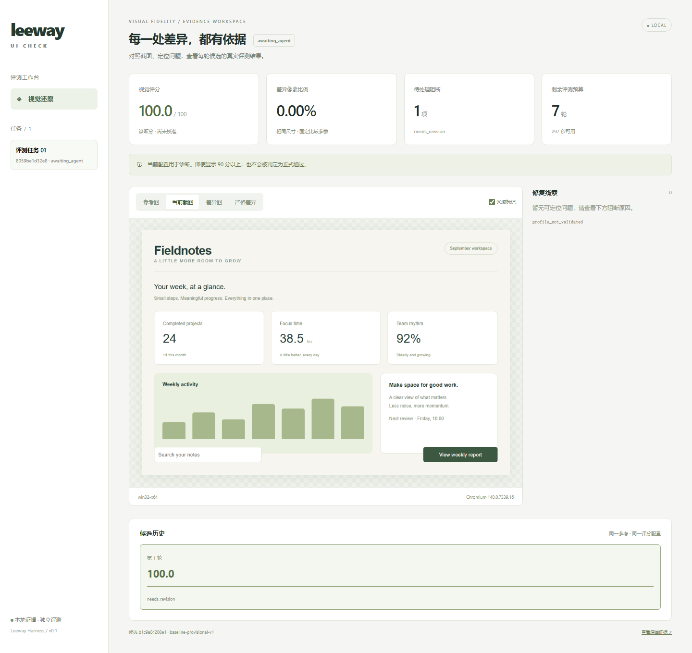

# Leeway UI Check

为 AI 编码 Agent 提供截图对比、问题定位和可追溯的 UI 评测结果。

你提供参考截图和页面要求，编码 Agent 修改页面，Leeway 用 Playwright 采集实现结果，返回像素、SSIM、布局和文字报告，帮助下一轮修复。

[快速开始](#快速开始) · [接入自己的项目](guides/usage.md) · [Agent / MCP](guides/mcp.md) · [能力范围](guides/status.md)



上图是内置示例的实际报告。100 分表示该示例的指标一致；默认配置未校准，因此不会正式通过。示例由固定脚本生成，不是模型自动修复案例。

## 能做什么

- 对照参考图和页面截图，查看普通、严格差异图与区域问题。
- 将文字、几何、交互及资源错误作为独立阻断条件。
- 通过五个 MCP 工具提交代码版本、查询反馈、取消和交付。
- 保存每轮源码 manifest、报告和证据；交付前复核当前工作区版本。

**当前为本地单用户早期版本。** 默认分数用于诊断，正式验收需要已验证的 profile。OCR、视觉模型、安全隔离和真实模型自动收敛尚未实现或验收。详见 [能力范围](guides/status.md)。

## 快速开始

已验证的开发环境：Windows / PowerShell、Node 22.16.0、Python 3.13。安装仅首次需要：

```powershell
git clone https://github.com/Eimi-Fukada/leeway-ui-check.git
cd leeway-ui-check
npm ci
python -m venv .venv
.\.venv\Scripts\python.exe -m pip install -r workers/requirements.txt
npm run setup:browser
```

运行三个预设页面变体并打开报告：

```powershell
npm run build
npm run demo
npm run cli -- report
```

访问 [本地报告页](http://127.0.0.1:4318)。查看 [示例说明](examples/README.md)，了解偏移、错误文字和完全一致分别产生什么反馈。

## 用在你的项目里

1. 从 [完整任务模板](examples/task.template.json) 配置参考图、视口、源码目录和启动命令。
2. 按 [使用指南](guides/usage.md) 创建任务并启动 worker。
3. 按 [MCP 指南](guides/mcp.md) 连接编码 Agent，提交并读取反馈。

```text
Agent 修改源码 → submit → worker 截图与比较 → 报告 → Agent 再次修改
```

Harness 不自动猜测按钮的业务行为。需要检查的交互须写入任务配置；报告中的修改建议是待验证的假设。

## 文档

- [使用指南](guides/usage.md)：自定义项目、命令、环境变量。
- [MCP 接入](guides/mcp.md)：工具、参数、Agent 指令与接口迁移。
- [常见问题](guides/faq.md)：100 分未通过、Python、重复提交与错误恢复。
- [架构](guides/project-tour.md)：模块职责和实际执行链路。
- [评分校准](evals/calibration/README.md)：权重、证据和正式验收。
- [更新记录](CHANGELOG.md) · [贡献指南](CONTRIBUTING.md) · [安全边界](SECURITY.md)。

## 反馈与贡献

欢迎提交问题和最小复现。请移除截图、日志和配置中的敏感信息。详见 [贡献指南](CONTRIBUTING.md)。

## 许可

[MIT](LICENSE)
