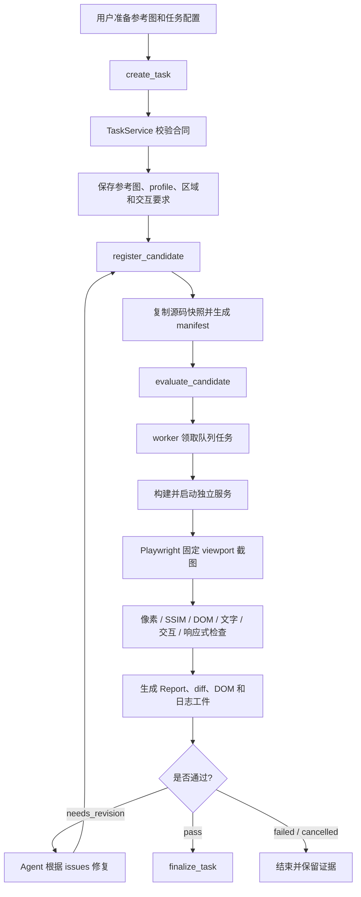

# 项目导览：从截图到可交付结果

如果你第一次看这个项目，建议按下面顺序阅读：

1. 先看本页的“主流程”，理解 Harness 解决什么问题。
2. 再看 [TaskInput 合同](../packages/contracts/src/index.ts)，它说明一次评测需要什么输入。
3. 接着看 [TaskService](../packages/core/src/tasks/service.ts)，这是整个流程的总调度入口。
4. 再看 [截图采集](../packages/core/src/capture/runner.ts) 和 [评分](../packages/core/src/scoring/evaluate.ts)。
5. 最后看 [CLI](../packages/cli/src/index.ts)、[MCP](../packages/mcp/src/server.ts) 和 [报告页](../apps/report-web/src/main.tsx)。

## 这个项目能干什么

它不是截图转代码工具，也不是通用的视觉设计工具。它的职责是：

```text
给它一张参考截图和一个 Web 项目
→ 启动项目并截取当前页面
→ 判断当前页面和参考图差在哪里
→ 返回分数、阻断原因、差异图和修复建议
→ 让编码 Agent 修改代码后再次评测
```

它回答的是：

> “这次代码修改后的页面，是否达到了这张参考图和任务要求？”

## 一次完整任务怎么流转



### 1. 创建任务

Owner 提供：

- 参考图片路径
- viewport、DPR、滚动位置
- 目标项目目录或外部 URL
- 启动/构建命令
- 关键区域 selector 和 bbox
- expected text
- 必须通过的交互
- 评分 profile 和预算
- 是否强制响应式探测

这些内容会被 `TaskInput` 用 Zod 校验。任务创建后，参考图和 profile 会被冻结。

### 2. 注册候选

Agent 修改目标源码后调用 `register_candidate`。

Harness 会把源码复制到独立快照目录，并生成：

- source manifest hash
- asset manifest hash
- build config hash
- candidate id

之后 Agent 再修改工作区，也不会改变本轮正在评测的快照。

### 3. 评测候选

`evaluate_candidate` 只负责把任务放进 SQLite 队列。真正执行的是独立 worker。

worker 会：

1. 检查任务和候选仍然有效。
2. 执行构建命令。
3. 在独立端口启动页面服务。
4. 记录 console error、page error、失败请求、缺失图片和字体问题。
5. 等待 ready selector、字体和图片加载。
6. 连续截图，确认页面稳定。
7. 执行参考 viewport 截图。
8. 执行响应式 probe viewport 检查。
9. 执行交互检查。
10. 保存当前截图、DOM、差异图、严格差异图和日志。

### 4. 得到报告

评分由四个主要视觉分项组成：

```text
pixel      0.35
structure  0.20
layout     0.30
text       0.15
```

这四个值是默认初始值，Owner 可以在 profile 中自行配置，但权重必须合计为 1。

另外还有独立阻断条件：

- 关键区域缺失
- 关键文字错误
- 关键区域溢出
- 关键区域像素差异过大
- 交互失败
- 运行时资源失败
- 截图不稳定
- 响应式布局失败
- profile 尚未完成校准

报告中的 `observed` 是测量事实；`suggestion` 是修复假设。系统不会把猜测写成确定根因。

### 5. Agent 如何继续修复

推荐 Agent 使用 Facade MCP：

```text
ui_check_start
→ ui_check_submit_and_wait
→ 读取 score / blockers / issues
→ 修改代码
→ ui_check_submit_and_wait
→ 直到通过或预算结束
→ ui_check_finalize
```

`ui_check_submit_and_wait` 内部会完成候选冻结、排队、截图、比较和报告返回。Agent 不需要直接管理 candidate id、evaluation id、lease 或 artifact。

## 代码目录地图

| 目录                           | 负责什么                                                      |
| ------------------------------ | ------------------------------------------------------------- |
| `packages/contracts`           | Task、Profile、Report、Issue 等输入输出合同，以及 JSON Schema |
| `packages/core/src/tasks`      | 任务创建、候选注册、队列、评测、取消和交付                    |
| `packages/core/src/candidates` | 源码快照、manifest、受管进程和进程树回收                      |
| `packages/core/src/capture`    | Playwright 截图、稳定性检查、DOM 信息、响应式探测             |
| `packages/core/src/compare`    | sharp 预处理、pixelmatch、SSIM worker 调用                    |
| `packages/core/src/scoring`    | 区域几何、文字相似度、分数和阻断条件                          |
| `packages/core/src/controller` | Agent 自动修复循环和修复策略选择                              |
| `packages/core/src/project`    | React/Vue/Svelte、Vite/Next、入口和样式工具识别               |
| `packages/core/src/regions`    | DOM/OCR/视觉区域建议；当前需要人工确认                        |
| `packages/core/src/sandbox`    | 可选沙箱策略和受管环境变量                                    |
| `packages/mcp`                 | MCP Server、Agent Facade 和底层工具                           |
| `packages/cli`                 | CLI 命令入口和独立 worker 启动入口                            |
| `apps/report-web`              | 本地只读报告界面                                              |
| `workers`                      | Python SSIM worker 和服务存活监督程序                         |
| `scripts`                      | Demo、fixture、Schema 导出                                    |
| `tests`                        | 单元、真实浏览器集成和报告页 E2E 测试                         |

## 你实际需要记住的三个命令

第一次安装：

```powershell
npm ci
npm run setup:browser
python -m venv .venv
.\.venv\Scripts\python.exe -m pip install -r workers/requirements.txt
```

跑示例：

```powershell
npm run demo
```

启动报告页：

```powershell
npm run cli -- report
```

真实任务的详细 CLI 和 MCP 配置见 [使用指南](usage.md)。

## 当前边界

当前项目是本地单用户 Harness。它已经能完成确定性的截图评测和多轮任务状态管理，但以下内容仍需要真实项目验证：

- 真实 Codex 编码适配器的自动修复效果
- calibration/heldout 对 90 分阈值的正式校准
- OCR 和视觉模型 provider 的真实接入
- OS 级 VM/AppContainer 安全隔离
- 多系统字体渲染一致性

这些边界不是项目不能继续做，而是当前版本没有把未验证能力伪装成已完成能力。
